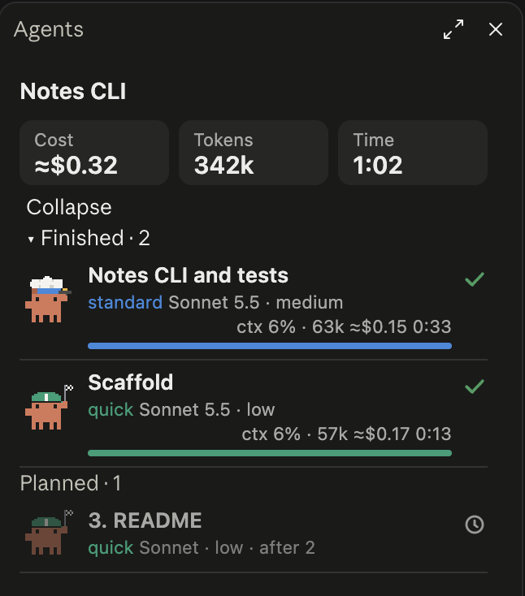

# serhan-kit

A Claude Code plugin with an orchestrated delivery flow. Run `/serhan <task>` (`/serhan:serhan` when installed as a plugin): the session model plans, owns design, delegates implementation to tiered worker subagents (at most 3 in parallel) and reviews what they return.

Derived from [johnnyvizz/claude-kit](https://github.com/johnnyvizz/claude-kit) (`savvy-flow`, MIT).

## Why this fork

The original is tuned for heavy usage: most workers run on Opus at high effort, and independent tasks fan out without a limit. This version is tuned for people on a $20 plan who want to keep token usage reasonable:

- **Sonnet-first tiers.** Three of the five workers run on Sonnet; Opus is kept for investigation and the rare hardest tasks.
- **Start low, escalate on failure.** When unsure which tier to use, the orchestrator starts with the cheaper one and moves a task up only if the worker comes back blocked.
- **At most 3 workers in parallel.** Extra ready tasks run in waves, so usage and rate limits are not hit all at once.
- **Reserve top tier.** `serhan-expert` is used only when a task clearly needs it.

Other changes: renamed everything to `serhan`, and the progress mod has a Turkish panel (`tr`).

## Tiers

Start from the lowest tier that can do the job; escalate one tier only if the worker comes back blocked.

| Agent | Model / effort | For |
| --- | --- | --- |
| `serhan-quick` | Sonnet / low | mechanical edits, builds, tests |
| `serhan-standard` | Sonnet / medium | standard feature work |
| `serhan-precise` | Sonnet / high | delicate, well-understood changes |
| `serhan-investigator` | Opus / medium | unfamiliar code, root-cause hunting |
| `serhan-expert` | Opus / high | reserve tier: hardest logic and bugs |

Change a tier's model in `plugins/serhan/agents/<agent>.md` (`model:` and `effort:`) and keep the table in `plugins/serhan/skills/serhan/SKILL.md` section 3 in sync.

## Progress panel (optional mod)

`serhan-progress` is a separate plugin that adds a live view of what the flow is doing:



- **Progress bar** above the prompt: task title, phase (plan, design, delegate, review), accepted tasks out of planned, and a button with the number of running agents that opens the panel.
- **Agents panel** (`/agents-info` toggles it): running, finished and planned subagents, each with its model and effort, task progress, context usage, estimated cost and elapsed time. Every tier has its own animated crab costume: expert (astronaut), investigator (detective), precise (engineer), standard (chef), quick (racer).
- **Languages:** English, Russian and Turkish (`language` option, `auto` by default).

It works with any subagents, but it is built for `/serhan`: the skill reports the plan and accepted tasks to it, and each worker reports its own steps. See [plugins/serhan-progress/README.md](plugins/serhan-progress/README.md).

| Plugin | What it is |
| --- | --- |
| `serhan` | the `/serhan` skill and the five tier agents |
| `serhan-progress` | the progress bar and agents panel (optional) |

## Install

```
/plugin marketplace add serhandenizhan/serhan-kit
/plugin install serhan@serhan-kit
```

Restart the session afterwards.

Optional: `/plugin install serhan-progress@serhan-kit` adds a progress bar above the prompt and a live agents panel (`/agents-info`) that the skill drives. Without it the skill's progress calls are skipped. Do not install it together with the original `savvy-progress`.

## License

MIT, see [LICENSE](LICENSE).
